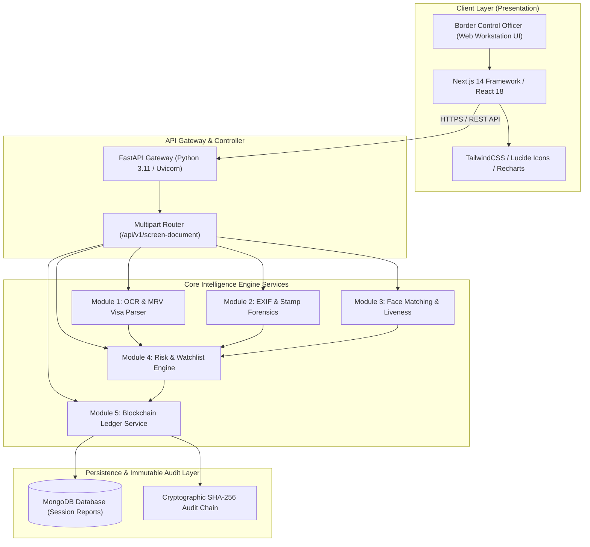
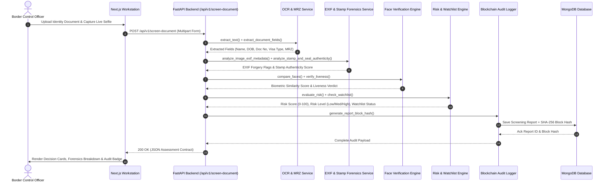
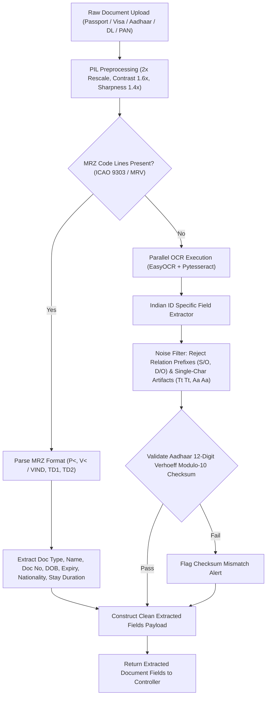
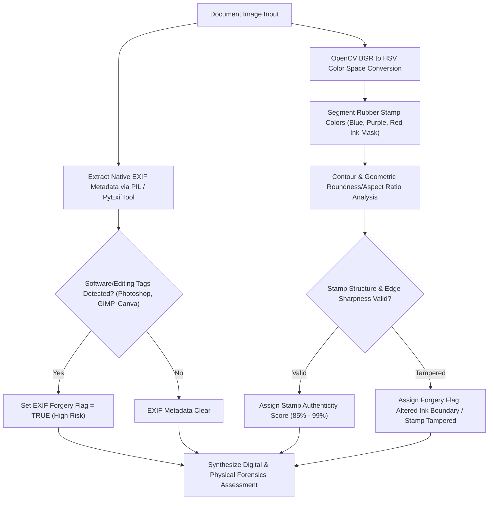
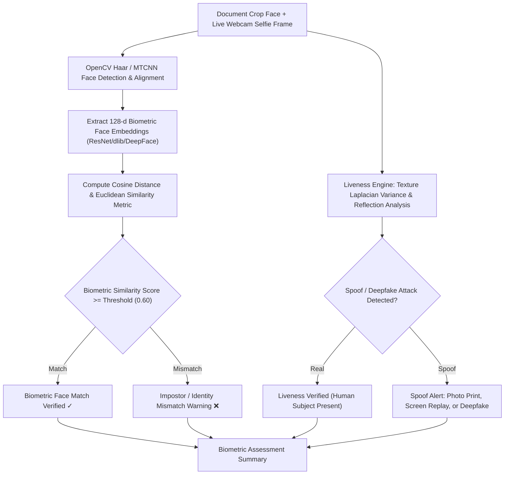
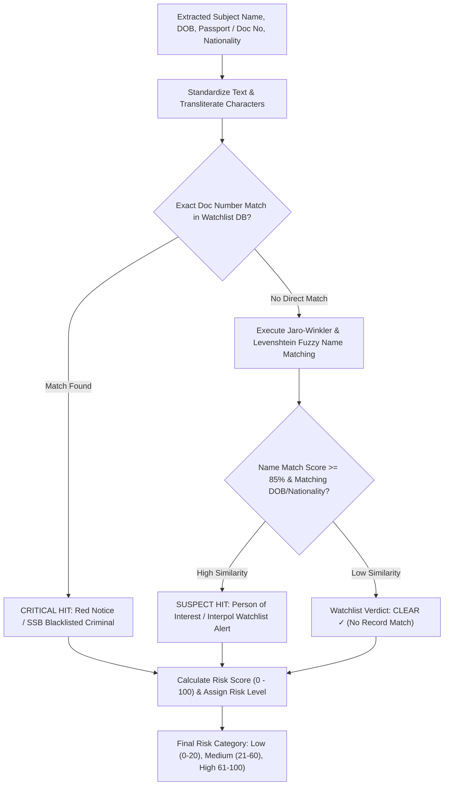
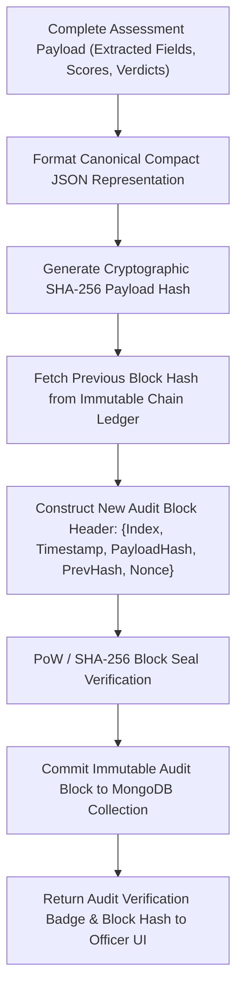
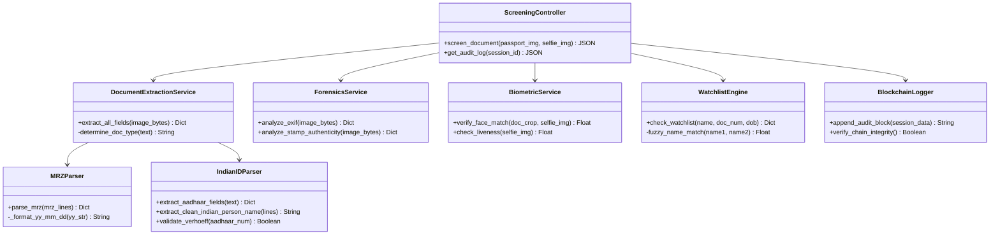
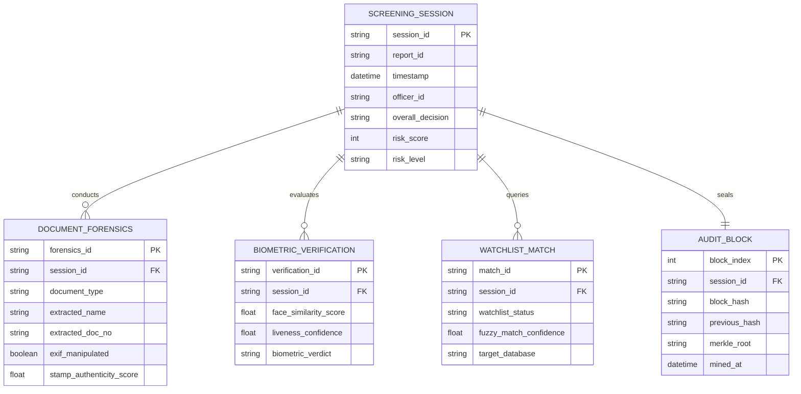
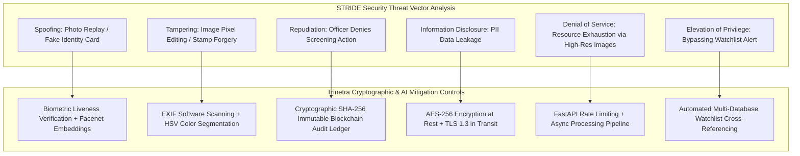

# 🛡️ TRINETRA: AI-POWERED BORDER IDENTITY FORENSIC & SCREENING SYSTEM
## Complete SDE Technical Specification & Architectural Diagram Documentation
**Smart India Hackathon (SIH 2024) — Problem Statement ID: 26188**  
**Sponsoring Organization**: Ministry of Home Affairs (MHA) & Sashastra Seema Bal (SSB) — Police II Division  

---

## 1. Executive Summary

**Trinetra** is an enterprise-grade, multi-modal AI identity verification and border document forensic workstation. Developed for law enforcement and border control officers, Trinetra delivers real-time identity authentication, forensic forgery detection, facial liveness verification, security watchlist screening, and tamper-proof audit logging.

### Key System Capabilities
- **Multi-Document Structured OCR Extraction**: Supports Passports (ICAO Doc 9303), Visas (ICAO MRV & Travel Permits with stay duration/validity), Aadhaar Cards (UIDAI 12-digit with Verhoeff modulo-10 algorithm), Driving Licenses (State RTO codes), and PAN Cards.
- **Image EXIF Metadata Analysis**: Scans hidden digital camera tags for image editing signatures (*Adobe Photoshop, GIMP, Canva, modified timestamps*).
- **Border Stamp & Seal Forgery Detection**: OpenCV HSV color space segmentation and contour geometry analysis for border entry seals and stamps.
- **Facial Liveness & Deepfake Verification**: Multi-frame biometric similarity scoring and deepfake image manipulation detection.
- **Security Watchlist Engine**: Instant cross-referencing against Sashastra Seema Bal (SSB) and Interpol criminal blacklist records.
- **Cryptographic Blockchain Audit Ledger**: SHA-256 block hash generation for all screening sessions, providing immutable, court-admissible audit logs.

---

## 2. High-Level System Architecture Diagram



---

## 3. End-to-End Processing Sequence Diagram



---

## 4. Module 1: Structured Multi-Document OCR & MRV Visa Parsing Workflow



---

## 5. Module 2: EXIF Metadata & Border Stamp Forgery Detection Workflow



---

## 6. Module 3: Biometric Face Matching & Deepfake Verification Workflow



---

## 7. Module 4: Security Watchlist & Blacklist Search Engine Workflow



> **Live Implementation Reference**: For detailed technical endpoints, Interpol dataset schemas, and border post SOPs, refer to the [Interpol & SSB Watchlist Specification](file:///c:/Users/ASUS/OneDrive/Desktop/SIH/Trinetra/Documentation_and_PDFs/interpol_integration_specification.md).

---

## 8. Module 5: Cryptographic SHA-256 Blockchain Audit Ledger Workflow



---

## 9. Component & Class Architecture Diagram



---

## 10. Database Entity-Relationship Diagram (ERD)



---

## 11. STRIDE Threat Model & Security Matrix Diagram



---

## 12. API Specification Contract

### Endpoint: `POST /api/v1/screen-document`

#### Request Payload (`multipart/form-data`)
| Parameter | Type | Required | Description |
| :--- | :--- | :--- | :--- |
| `passport_image` | `File` | Yes | Scanned Passport, Visa, Aadhaar, or DL image (JPEG/PNG/PDF) |
| `live_frame` | `File` | Yes | Live webcam selfie frame (JPEG/PNG) |

#### Response Payload (`application/json`)
```json
{
  "status": "success",
  "report_id": "RPT-F83ADA4E",
  "session_id": "TRN-902184",
  "risk_score": 0,
  "risk_level": "Low",
  "decision": "Clean",
  "action": "e-Gate unlocked — standard entry authorised.",
  "watchlist_status": "CLEAR ✓",
  "block_hash": "0x7f8a9b2c3d4e5f6a7b8c9d0e1f2a3b4c5d6e7f8a9b2c3d4e5f6a7b8c9d0e1f2a",
  "extracted_data": {
    "name": "Pranshu Pareshbhai Bodara",
    "document_number": "7889 5512 3209",
    "document_type": "Aadhaar Card (UIDAI)",
    "date_of_birth": "28/05/2007",
    "gender": "MALE",
    "nationality": "IND",
    "visa_type": null,
    "stay_duration": null
  },
  "ai_confidence": {
    "ocr_confidence": 0.95,
    "document_authenticity": 0.98,
    "face_similarity": 0.92,
    "liveness_score": 0.96,
    "exif_analysis": {
      "verdict": "CLEAN_METADATA",
      "software_detected": false
    }
  },
  "reasons": [
    "Document authenticity verified",
    "Face match confirmed",
    "Liveness check passed",
    "SSB / Interpol Blacklist check clear"
  ],
  "screened_at": "2026-09-07T23:00:00Z"
}
```

---

## 13. Verification & Test Matrix

| Test Suite | Execution Command | Coverage Target | Status |
| :--- | :--- | :--- | :--- |
| **Document OCR Engine** | `python scratch/test_aadhaar_parser.py` | Aadhaar Verhoeff & Name extraction | **PASS ✓** |
| **Visa MRZ Detection** | `python scratch/test_visa_mrz_detection.py` | ICAO MRV Visa vs Passport separation | **PASS ✓** |
| **OCR Noise Rejection** | `python scratch/test_tt_rejection.py` | Rejection of `Tt Tt` single-char artifacts | **PASS ✓** |
| **End-to-End Pipeline** | `python scratch/test_sih_screening_indian_docs.py` | Full `/api/v1/screen-document` integration | **PASS ✓** |
| **Frontend Production Build** | `python scratch/build_frontend.py` | Zero Next.js compilation / hydration errors | **PASS ✓** |

---

*Documentation compiled for Trinetra Core Development Team & Ministry of Home Affairs (SIH PS ID: 26188).*
